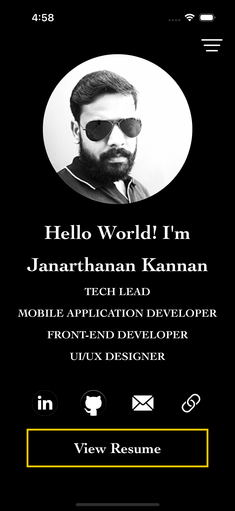
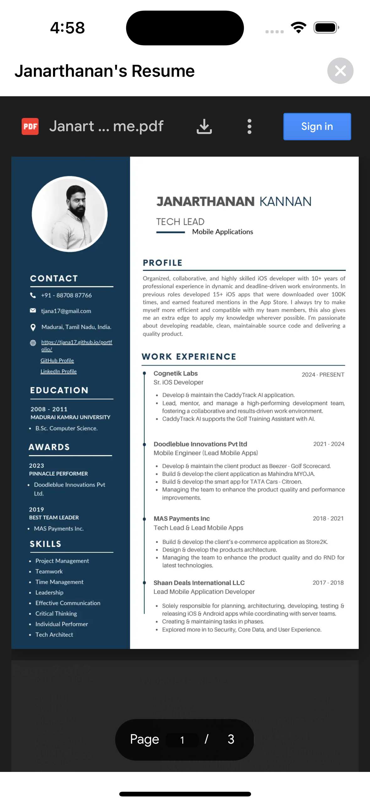
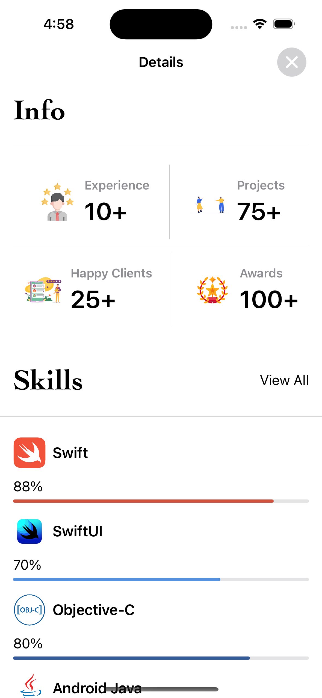
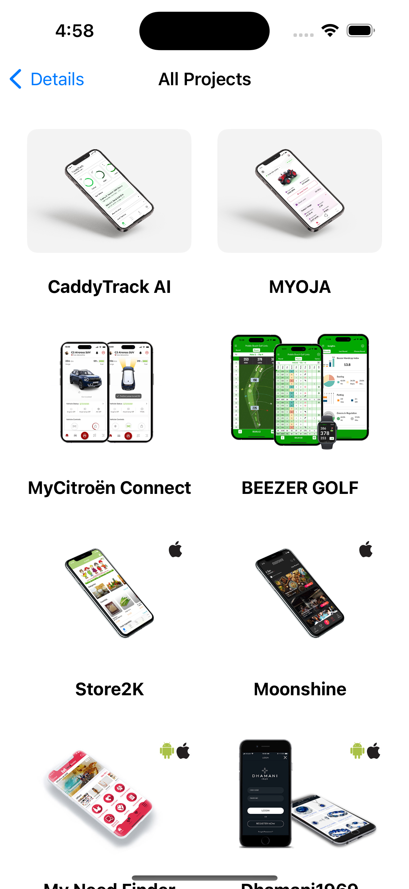
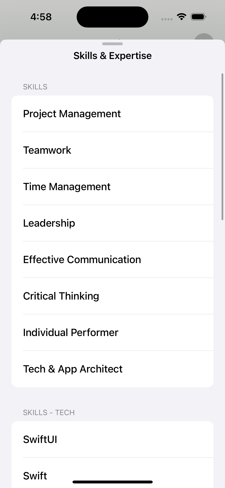

<h3>Portfolio App - SwiftUI</h3>

Portfolio App - SwiftUI is a simple Personal Portfolio app with list of apps and achievements done by Janarthanan Kannan(Myself) using the lottie & SwiftUI animations.
   
<h3>Tech Used</h3>

<ul>
  <li>Designed with MVVM architecture</li>
  <li>Swift 5</li>
  <li>SwiftUI</li>
  <li>PDF Viewer</li>
  <li>Lottie & SwiftUI Animations</li>
  <li>XCode 15</li>
</ul>
  

<h3>Screens</h3>

